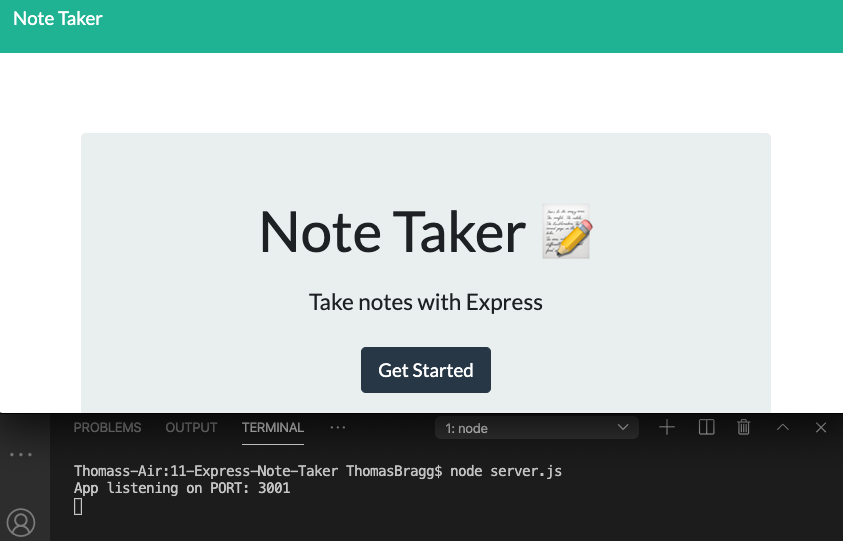
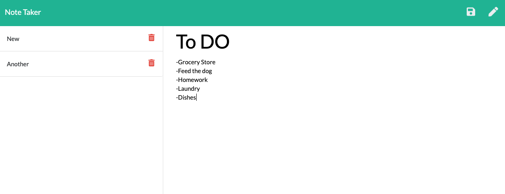

# 11-Express-Note-Taker

##  Repository: 
[10-Template-Engine-Employee-Summary](https://github.com/TBragg800/11-Express-Note-Taker)

## Walkthrough Video Demonstration: 

* YouTube link to the 
[walkthrough](https://youtu.be/uT-WC-XmrIk)

## Table of Contents
  [Description](#Description)

  [Installation](#Installation)

  [Usage](#Usage)

  [License](#License)

  [Contributing](#Contributing)

  [Tests](#Tests)

  [Questions](#Questions)
  
## Description
  This application utilizes node.js and express.js backend technologies to write, save and delete user generated notes offering the user the ability to organize thoughts and keep track of tasks.

## Installation
 Installation is not neccessary for this application. See usage for navigating to the deplyed site. If installation is preferred, navigate to the github repository listed above and clone the repo locally. Using the CLI, the user should navigate to the project directory and run 'npm install'. Next start the server by running 'node server.js'. In the browser, use http:localhost:3001 to navigate to the site.

## Usage
  Start by visiting the Heroku deployed page at https://fathomless-dusk-80816.herokuapp.com/. Navigate from the starting page to the notes page. Add a title and text content to each of your notes then hit save. You can add new notes by clicking the pen button in the top right corner, review notes by clicking into the saved note or delete previous notes by clicking the trash button next to the specific note.

## License
  MIT License

Copyright (c) 2020 Thomas Bragg

Permission is hereby granted, free of charge, to any person obtaining a copy
of this software and associated documentation files (the "Software"), to deal
in the Software without restriction, including without limitation the rights
to use, copy, modify, merge, publish, distribute, sublicense, and/or sell
copies of the Software, and to permit persons to whom the Software is
furnished to do so, subject to the following conditions:

The above copyright notice and this permission notice shall be included in all
copies or substantial portions of the Software.

THE SOFTWARE IS PROVIDED "AS IS", WITHOUT WARRANTY OF ANY KIND, EXPRESS OR
IMPLIED, INCLUDING BUT NOT LIMITED TO THE WARRANTIES OF MERCHANTABILITY,
FITNESS FOR A PARTICULAR PURPOSE AND NONINFRINGEMENT. IN NO EVENT SHALL THE
AUTHORS OR COPYRIGHT HOLDERS BE LIABLE FOR ANY CLAIM, DAMAGES OR OTHER
LIABILITY, WHETHER IN AN ACTION OF CONTRACT, TORT OR OTHERWISE, ARISING FROM,
OUT OF OR IN CONNECTION WITH THE SOFTWARE OR THE USE OR OTHER DEALINGS IN THE
SOFTWARE.

## Contributing
  Fork the project & clone locally. Create an upstream remote and sync your local copy before you branch. Branch for each separate piece of work. Do the work, write good commit messages, and read the CONTRIBUTING file if there is one. Push to your origin repository. Create a new PR in GitHub.

## Tests
  There are no current tests for this applications.

## Questions
  All questions should be submitted to the email listed below. Please consult the GitHub profile or Repo for additional concerns. 
  Email: Ttbbragg83@gmail.com
  Github: [TBragg800](http://github.com/TBragg800)

## Screenshot of deployed application
